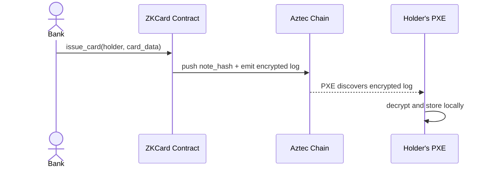
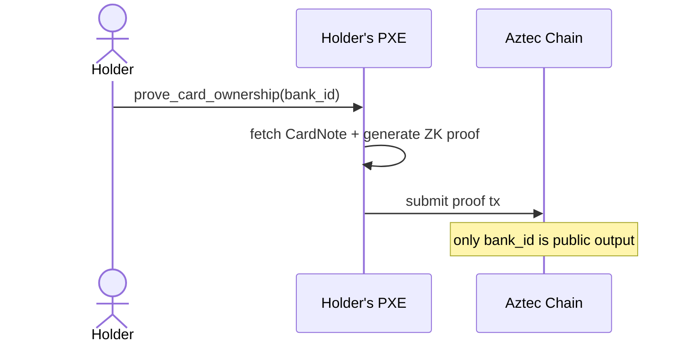
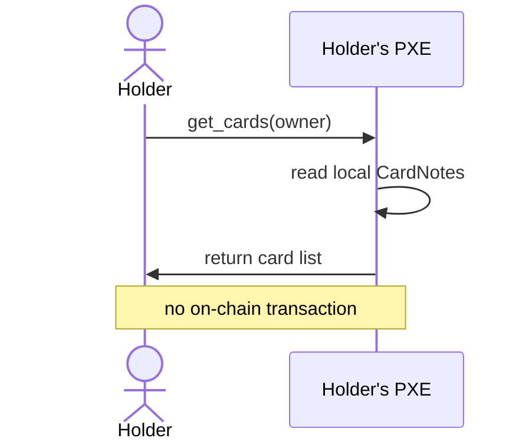

# ZK Card

A prototype for private credit card ownership on Aztec. A bank issues a card as an encrypted note; the holder can later prove they own a card from that bank, without revealing the card number, expiry, or limit.


## Architecture

**Issue** — bank calls `issue_card`; the card data is stored as an encrypted note in the holder's PXE, never exposed on-chain.



**Prove** — holder calls `prove_card_ownership(bank_id)`; generates a ZK proof of note membership. Only the bank's identity is a public output.



**View** — holder calls `get_cards`; reads directly from the local PXE, no transaction needed.



## Stack

- **Contract**: Noir + aztec-nr `v4.2.0-aztecnr-rc.2`
- **UI**: Next.js 16 + Tailwind CSS
- **Network**: Aztec sandbox (local)

## Running locally

```bash
aztec start --local-network   # start sandbox at localhost:8081
pnpm install
pnpm dev                      # open http://localhost:3000
```

## Usage

1. **Deploy** — click the badge in the bottom-right corner to deploy the contract.
2. **Issue a card** (`/bank`) — connect and fill in the Issue Card form.
3. **View & prove** (`/user`) — connect; cards load automatically. Use Generate ZK Proof to prove card ownership without revealing any card details.
4. **Buy** (`/store`) — claim the book with a ZK ownership proof.
