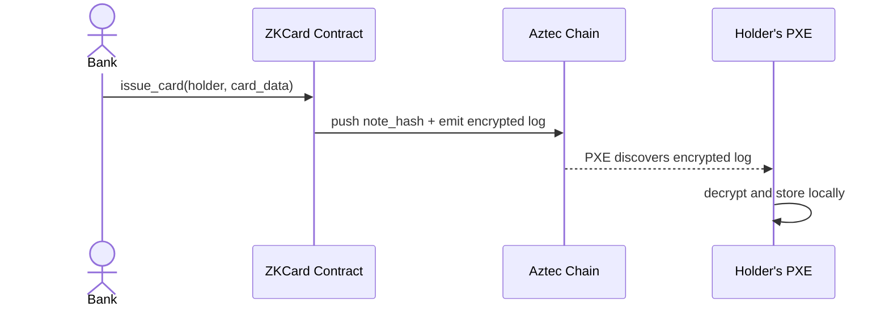
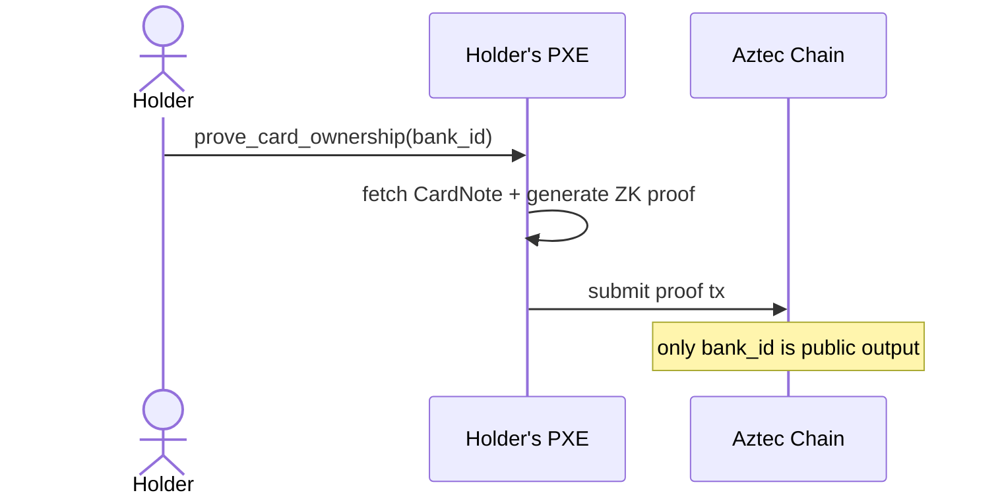
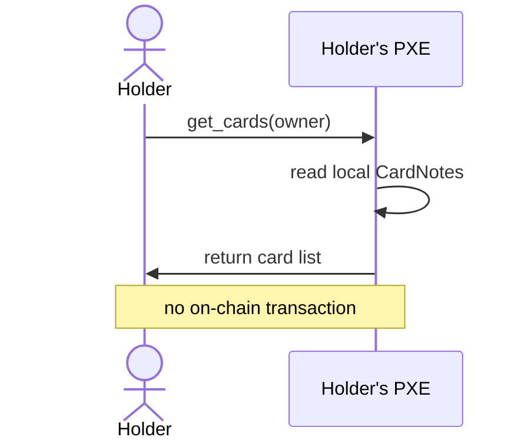

# ZK Card

A prototype that demonstrates private credit card ownership using Aztec's ZK infrastructure.

A bank issues a card as an encrypted private note on Aztec. The cardholder can later prove they own a card from that bank — without revealing the card number, expiry date, or credit limit. Only the bank's identity is disclosed.


## How it works

1. **Deploy** — admin deploys the contract and authorizes banks (public, visible on-chain)
2. **Issue** — bank calls `issue_card`, which stores a `CardNote` (card number hash, expiry, credit limit) as an encrypted note in the holder's PXE
3. **Prove** — holder calls `prove_card_ownership(bank_id)`, generating a ZK proof that they hold a valid card from that bank — returning only `bank_id`
4. **View** — holder can list their own cards locally via `get_cards` (no on-chain data exposed)

## Flows

### Card Issuance



### Ownership Proof



### Card Lookup



## Stack

- **Contract**: Noir + aztec-nr `v4.2.0-aztecnr-rc.2`
- **UI**: Next.js 16 + Tailwind CSS
- **Network**: Aztec sandbox (local)

## Requirements

- [Node.js](https://nodejs.org/) v20+
- [pnpm](https://pnpm.io/) v10+
- [Aztec CLI](https://docs.aztec.network/getting_started)

## Running locally

**1. Start the Aztec sandbox**

```bash
aztec start --local-network
```

Runs at `localhost:8081`.

**2. Install dependencies**

```bash
pnpm install
```

**3. Start the UI**

```bash
pnpm dev
```

Open [http://localhost:3000](http://localhost:3000).

**4. (Optional) Recompile the contract**

```bash
pnpm compile
```

Output goes to `packages/contracts/target/`.

## Usage

1. **Deploy the contract** — a status badge sits in the bottom-right corner of every page. When the sandbox is running it shows **Deploy contract** (red). Click it once to deploy.

2. **Issue a card** (`/bank`) — click **Connect**, then fill in the **Issue Card** form. The bank's address is used as the card issuer; the card is stored as an encrypted private note in the user's PXE.

3. **View cards and generate proofs** (`/user`) — click **Connect**. Your cards appear automatically. Use **Generate ZK Proof** to prove ownership of a card from a specific bank without revealing any card details.

4. **Buy something** (`/store`) — open the store, click **Claim free copy with ZK Card**, select a card, and submit. The purchase is gated on a ZK ownership proof.
